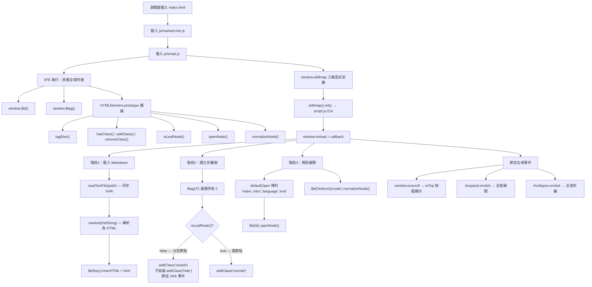

# API_SURFACE.md — JavaScript 公開介面與 DOM 介面參考

> 本文件描述 StuQ 技能圖譜（純靜態前端）對外暴露的所有「介面」：
> JavaScript 全域函式、HTMLElement prototype 擴展、DOM 結構規範，以及貢獻者 Markdown 格式規範。
>
> 源碼位置：`js/script.js`（約 215 行，ES5 Vanilla JS）

---

## 目錄

1. [JavaScript 全域介面](#1-javascript-全域介面)
2. [HTMLElement Prototype 擴展方法](#2-htmlelement-prototype-擴展方法)
3. [DOM 介面（HTML 模板規範）](#3-dom-介面html-模板規範)
4. [貢獻者 Markdown 格式規範](#4-貢獻者-markdown-格式規範)
5. [JavaScript 呼叫關係圖](#5-javascript-呼叫關係圖)

---

## 1. JavaScript 全域介面

所有全域符號均在 `js/script.js` 頂層 IIFE（`script.js:9–60`）中掛載至 `window`。

### `window.$id(id)`

| 項目 | 說明 |
|------|------|
| 功能 | `document.getElementById` 的簡短別名 |
| 參數 | `id` {string} — 目標元素的 id 屬性值 |
| 回傳值 | `HTMLElement \| null` — 找到時回傳元素，否則回傳 `null` |
| 定義位置 | `script.js:12–14` |

```javascript
// 使用範例
var el = $id('frontEnd');   // 取得 id="frontEnd" 的 div
```

---

### `window.$tag(tagName)`

| 項目 | 說明 |
|------|------|
| 功能 | `document.getElementsByTagName` 的簡短別名 |
| 參數 | `tagName` {string} — HTML 標籤名稱（如 `'li'`、`'ul'`） |
| 回傳值 | `HTMLCollection` — 頁面上所有符合標籤名稱的元素集合（動態更新） |
| 定義位置 | `script.js:16–18` |

```javascript
// 使用範例
var allLi = $tag('li');     // 取得頁面所有 <li> 元素
```

---

### `window.skillmap()`

| 項目 | 說明 |
|------|------|
| 功能 | 工廠函式（Factory Function），採用 Revealing Module Pattern |
| 參數 | 無 |
| 回傳值 | `{ init: Function }` — 僅暴露 `init` 方法的物件 |
| 定義位置 | `script.js:64–211` |
| 呼叫時機 | `script.js:214` — 檔案載入後立即執行 `skillmap().init()` |

工廠函式內部封裝了三個私有函式：

| 私有函式 | 簽名 | 功能 |
|----------|------|------|
| `newRequest()` | `() → XMLHttpRequest \| ActiveXObject` | 跨瀏覽器建立 XHR 物件（含 IE ActiveX fallback） |
| `readTextFile(file)` | `(string) → string` | 以同步 GET XHR 載入文字檔案（Markdown 原始碼） |
| `scrollTo(element, to, duration)` | `(Element, number, number) → void` | 以遞迴 `setTimeout` 實作平滑捲動動畫 |

---

### `skillmap().init()`

| 項目 | 說明 |
|------|------|
| 功能 | 初始化整個應用程式，設定 `window.onload` callback |
| 參數 | 無 |
| 回傳值 | `void` |
| 定義位置 | `script.js:124–206` |

**初始化流程（三個階段）：**

**階段 1 — 載入並注入 Markdown（`script.js:126–138`）**

讀取 `mdList` 物件中每個 key 對應的 `.md` 檔案，透過 `marked()` 解析為 HTML 後，注入至對應 id 的 `<div>` 元素：

```javascript
var mdList = {
  'devLang':        'data/dev-lang.md',
  'bigData':        'data/big-data.md',
  'cloudComputing': 'data/cloudComputing.md',
  'frontEnd':       'data/frontEnd.md',
  'IH':             'data/IH.md',
  'IOAM':           'data/IOAM.md',
  'security':       'data/security.md'
};
// 映射規則：$id(key).innerHTML = marked(readTextFile(path))
```

> **注意**：上述路徑均已失效（`data/` 目錄已重構改名），詳見 `.trace/_context/recon.md` 落差清單。

**階段 2 — 建立可折疊樹狀結構（`script.js:140–162`）**

遍歷所有 `<li>` 元素，依葉節點判斷結果套用 class：

| 條件 | 套用 class | 行為 |
|------|-----------|------|
| 有子 `<li>`（非葉節點） | `closed`，子容器加 `hide` | 可點擊展開／折疊 |
| 無子 `<li>`（葉節點） | `normal` | 不可互動 |

**階段 3 — 預設展開指定節點（`script.js:164–167`）**

```javascript
var defaultOpen = ['index', 'intro', 'language', 'end'];
```

這四個 id 對應的節點在頁面載入後自動展開（呼叫 `openNode()`）。`bottomQrcode` 節點則呼叫 `normalizeNode()` 特殊處理。

---

## 2. HTMLElement Prototype 擴展方法

所有方法直接擴展至 `HTMLElement.prototype`（IE 降級至 `Element.prototype`），定義於 `script.js:20–59`。擴展後，頁面上的每個 DOM 元素均可直接呼叫。

### `element.tagEles(tagName)`

| 項目 | 說明 |
|------|------|
| 簽名 | `tagEles(tagName: string): HTMLCollection` |
| 功能 | 以當前元素為根，取得指定標籤名稱的所有後代元素 |
| 實作 | `this.getElementsByTagName(tagName)` |

```javascript
var childLis = someDiv.tagEles('li');
```

---

### `element.hasClass(className)`

| 項目 | 說明 |
|------|------|
| 簽名 | `hasClass(className: string): boolean` |
| 功能 | 判斷元素是否具有指定的 CSS class |
| 實作 | 以正則表達式比對 `this.className`，正確處理邊界空格 |

```javascript
if (li.hasClass('closed')) { /* ... */ }
```

---

### `element.addClass(className)`

| 項目 | 說明 |
|------|------|
| 簽名 | `addClass(className: string): void` |
| 功能 | 若尚未包含，則將 className 附加至元素的 class 清單 |
| 冪等性 | 重複呼叫不會重複加入相同 class |

```javascript
li.addClass('opened');
```

---

### `element.removeClass(className)`

| 項目 | 說明 |
|------|------|
| 簽名 | `removeClass(className: string): void` |
| 功能 | 若存在，則從元素的 class 清單中移除指定 className |
| 冪等性 | class 不存在時靜默忽略 |

```javascript
li.removeClass('closed');
```

---

### `element.isLeafNode()`

| 項目 | 說明 |
|------|------|
| 簽名 | `isLeafNode(): boolean` |
| 功能 | 判斷當前 `<li>` 元素是否為葉節點（即不含任何後代 `<li>`） |
| 回傳值 | `true` — 葉節點（末端技能項）；`false` — 分支節點 |

```javascript
if (!li.isLeafNode()) {
  li.addClass('closed');   // 非葉節點才可折疊
}
```

---

### `element.openNode()`

| 項目 | 說明 |
|------|------|
| 簽名 | `openNode(): void` |
| 功能 | 展開節點：移除子容器的 `hide` class，切換 class 為 `opened` |
| 副作用 | 修改 `this.lastElementChild`（子容器）與 `this` 的 class |
| 適用對象 | 含子清單的 `<li>` 元素 |

```javascript
$id('intro').openNode();   // 預設展開 intro 節點
```

---

### `element.normalizeNode()`

| 項目 | 說明 |
|------|------|
| 簽名 | `normalizeNode(): void` |
| 功能 | 將節點標記為「一般（不可折疊）」狀態：移除 `hide`、移除 `node` class、設定 cursor 為 `initial`、套用 `normal` class |
| 適用對象 | 僅用於 `bottomQrcode` 節點（結尾 QR Code 區塊） |

```javascript
$id('bottomQrcode').normalizeNode();
```

---

## 3. DOM 介面（HTML 模板規範）

### 3.1 mdList 映射規則

`init()` 中的 `mdList` 物件建立了 **DOM id → Markdown 檔案路徑** 的映射：

```
mdList key（DOM id）  →  Markdown 檔案路徑  →  解析後 HTML 注入目標
─────────────────────────────────────────────────────────────────────
devLang               →  data/dev-lang.md      →  <div id="devLang">
bigData               →  data/big-data.md      →  <div id="bigData">
cloudComputing        →  data/cloudComputing.md →  <div id="cloudComputing">
frontEnd              →  data/frontEnd.md       →  <div id="frontEnd">
IH                    →  data/IH.md             →  <div id="IH">
IOAM                  →  data/IOAM.md           →  <div id="IOAM">
security              →  data/security.md       →  <div id="security">
```

### 3.2 新增技能圖譜領域的 HTML 模板

新增一個可顯示技能圖譜的領域，需在 `index.html` 的 `<ul id="rootList">` 中插入以下結構：

```html
<!-- index.html 中的領域區塊模板 -->
<li id="{domainIndex}">
  <h2>{領域名稱}</h2>
  <span>（貢獻者：@{contributor}；下載：
    <a href="data/{filename}.md" download="{領域名稱}(StuQ 技能圖譜).md">{領域名稱}.md</a>
  ）</span>
  <!-- 必要：id 屬性必須與 mdList 的 key 完全一致 -->
  <div class="node" id="{mdListKey}"></div>
</li>
```

**必要 id 屬性說明：**

| id | 用途 |
|----|------|
| `{domainIndex}` | 快速導覽錨點目標（`<a href="#{domainIndex}">` 使用） |
| `{mdListKey}` | `mdList` 注入目標，必須在 `script.js` 的 `mdList` 物件中有對應 key |

### 3.3 頁面固定節點 id 清單

以下 id 在 `index.html` 中具有特殊語義，不得更動：

| id | 元素 | 用途 |
|----|------|------|
| `root` | `<div>` | 頁面根容器 |
| `rootList` | `<ul>` | 技能圖譜主清單 |
| `index` | `<li>` | 快速導覽區塊，預設展開 |
| `intro` | `<li>` | 說明區塊，預設展開 |
| `language` | `<li>` | 開發語言區塊，預設展開 |
| `end` | `<li>` | 結尾區塊，預設展開 |
| `bottomQrcode` | `<li>` | QR Code 區塊，以 `normalizeNode()` 特殊處理 |
| `toTop` | `<div>` | 回頂部按鈕，捲動後顯示 |
| `expand` | `<a>` | 全部展開按鈕 |
| `collapse` | `<a>` | 全部折疊按鈕 |

---

## 4. 貢獻者 Markdown 格式規範

這是本系統最重要的「外部 API」——貢獻者必須遵循此格式，系統才能正確解析並渲染技能樹。

### 4.1 分級規則

摘自 `README.md`（圖譜 MarkDown 分級規範章節）：

| 層級 | 使用符號 | 優先順序 | 渲染後的樹深度 |
|------|---------|---------|--------------|
| 高階主幹（第 1 層） | `#` | 最高 | 根節點 |
| 高階主幹（第 2 層） | `##` | 高 | 二級分支 |
| 高階主幹（第 3 層） | `###` | 中高 | 三級分支 |
| 次階分支（第 4 層） | `-`（連字號） | 中（高於 `*`） | 四級葉節點 |
| 次階分支（第 5 層） | `*`（星號） | 低（高於 `+`） | 五級葉節點 |
| 次階分支（第 6 層） | `+`（加號） | 最低 | 六級葉節點 |

**規則摘要：**
1. `#`、`##`、`###` 用於高階主幹分支（Heading）
2. `-`、`*`、`+` 用於次階項目清單（List），優先級依序遞減
3. `-` 優先級高於 `*`，`*` 優先級高於 `+`

### 4.2 完整示範範例

截取自 `/home/user/skill-map/data/map-FrontEndEngineer.md`：

```markdown
# 前端工程師技能圖譜

## 瀏覽器
    - IE6/7/8/9/10/11 (Trident)
    - Firefox (Gecko)
    - Chrome/Chromium (Blink)
    - Safari (WebKit)
    - Opera (Blink)

## 程式設計語言
    - JavaScript/Node.js
    - CoffeeScript
    - TypeScript

## 開發工具

### 編輯器和 IDE
    - VIM/Sublime Text2
    - Notepad++/EditPlus
    - WebStorm
    - Atom
    - Visual Studio/Visual Studio Code

### 除錯工具
    - Firebug/Firecookie
    - Chrome Dev Tools
    - Fiddler/Charles

### 版本管理
    - Git/SVN/Mercurial
    - Github/GitLab/Bitbucket

## 程式碼品質

### Coding style
    - Eslint/JSLint/JSHint/jscs
```

### 4.3 貢獻新技能圖譜的步驟

1. **建立 Markdown 檔案**：按命名慣例 `data/map-{DomainName}.md` 存放，遵循 §4.1 分級規則
2. **更新 `index.html`**：依 §3.2 模板新增 `<li>` 區塊
3. **更新 `script.js`**：在 `mdList` 物件中新增 `'key': 'data/map-{DomainName}.md'` 映射
4. **提交 PR**：發送 Pull Request 至 [TeamStuQ/skill-map](https://github.com/TeamStuQ/skill-map)，或寄信至 sean@geekbang.org

---

## 5. JavaScript 呼叫關係圖



---

*文件生成日期：2026-04-27*
*對應源碼版本：v0.1.2（`index.html` 標示）*
*授權：CC-BY-NC-SA 4.0*
