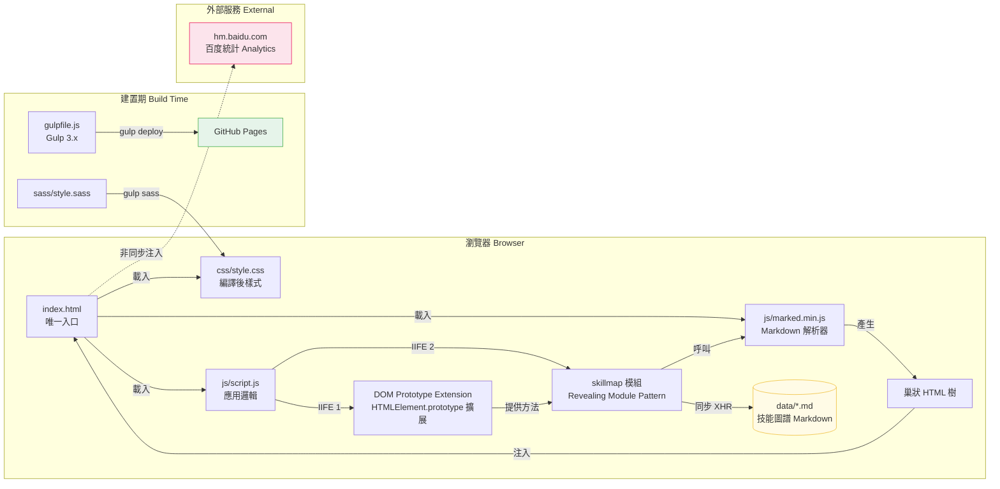

# StuQ Skill Map — 系統架構說明文件

> 版本：v0.1.2（index.html 標示）  
> 撰寫日期：2026-04-27  
> 授權：CC-BY-NC-SA 4.0

---

## 1. 高層架構描述

本專案為**純靜態前端單頁網站（Pure Frontend SPA）**，不含任何後端服務、資料庫或 API Server。

- 所有技能圖譜內容儲存為 `data/map-*.md` Markdown 文件，由瀏覽器端透過同步 XHR 讀取。
- 唯一的 HTML 頁面（`index.html`）在瀏覽器中透過 Vanilla JavaScript（ES5）動態組裝可折疊樹狀 UI。
- 建置工具（Gulp 3.x）僅負責 SASS 編譯與 GitHub Pages 部署，不參與執行期邏輯。
- 外部依賴僅有兩個：`marked.min.js`（Markdown 解析，已 bundle 至 repo）及百度統計（Baidu Analytics，非同步注入）。

```
使用者瀏覽器
    │
    ▼
index.html  ←── css/style.css
    │
    ├── js/marked.min.js   （Markdown→HTML 解析器）
    └── js/script.js       （應用邏輯）
            │
            └── data/*.md  （技能圖譜原始內容，同步 XHR 讀取）
```

---

## 2. 系統架構圖



---

## 3. 元件清單表格

| 元件名稱 | 職責 | 關鍵檔案 | 上游依賴 | 下游依賴 |
|----------|------|----------|----------|----------|
| **index.html** | 唯一 HTML 入口；定義靜態骨架 DOM 結構；掛載 script 與 style | `index.html` | — | `css/style.css`、`js/marked.min.js`、`js/script.js` |
| **style.css** | 控制樹狀 UI 視覺（opened/closed/normal 狀態、list-style-image） | `css/style.css`、`sass/style.sass`、`sass/_base.sass` | Gulp + gulp-sass | `index.html` |
| **marked.min.js** | 將 Markdown 文字解析為巢狀 HTML（`<ul>`/`<li>`） | `js/marked.min.js` | `index.html`（`<script>` 載入） | `script.js`（呼叫 `marked()`） |
| **DOM Prototype Extension** | 擴展 `HTMLElement.prototype`，提供 `addClass`/`removeClass`/`hasClass`/`openNode`/`normalizeNode`/`isLeafNode` 等方法 | `js/script.js:9-60` | 瀏覽器原生 DOM API | `skillmap` 模組 |
| **skillmap 模組** | 核心應用邏輯：XHR 讀取 `.md`、呼叫 `marked()` 注入 DOM、建立折疊樹、綁定事件 | `js/script.js:63-214` | `marked.min.js`、DOM Prototype Extension | `data/*.md`（資料來源） |
| **data/*.md** | 各技術領域技能圖譜原始內容（40+ 個 Markdown 文件） | `data/map-*.md` | 社群貢獻者（人工撰寫） | `skillmap` 模組（XHR 讀取） |
| **gulpfile.js** | 建置腳本：SASS 編譯（`gulp sass`）與 GitHub Pages 部署（`gulp deploy`） | `gulpfile.js` | Node.js、Gulp 3.x、gulp-sass、gulp-gh-pages | `css/style.css`（產出）、GitHub Pages（部署目標） |
| **百度統計** | 頁面瀏覽量追蹤，在 `<head>` 中非同步注入 `hm.js` | `index.html:10-17` | 外部 CDN（`hm.baidu.com`） | — |

---

## 4. 頁面初始化 Sequence Diagram

```mermaid
sequenceDiagram
    actor User as 使用者
    participant Browser as 瀏覽器
    participant HTML as index.html
    participant CSS as css/style.css
    participant Marked as js/marked.min.js
    participant Script as js/script.js
    participant XHR as 同步 XHR
    participant MD as data/*.md
    participant Baidu as 百度統計 hm.baidu.com

    User->>Browser: 開啟頁面 URL
    Browser->>HTML: GET index.html
    HTML-->>Browser: 回傳 HTML 骨架

    Browser->>CSS: GET css/style.css
    CSS-->>Browser: 回傳樣式

    Note over Browser,Baidu: head 中行內腳本（非同步，不阻塞）
    Browser-)Baidu: 非同步注入 hm.js（不阻塞）

    Browser->>Marked: GET js/marked.min.js
    Marked-->>Browser: 回傳 marked() 函式

    Browser->>Script: GET js/script.js
    Script-->>Browser: 回傳腳本

    Note over Browser,Script: script.js 執行期
    Browser->>Script: 執行 skillmap().init()
    Script->>Browser: 設定 window.onload callback

    Note over Browser: DOM 載入完成，觸發 window.onload

    loop 對每個 mdList 項目（共 7 個）
        Script->>XHR: readTextFile('data/xxx.md')
        XHR->>MD: 同步 GET（阻塞主線程）
        MD-->>XHR: 回傳 Markdown 文字
        XHR-->>Script: responseText
        Script->>Marked: marked(markdownText)
        Marked-->>Script: 巢狀 HTML 字串
        Script->>HTML: $id(key).innerHTML = html
    end

    Note over Script: 建立折疊樹狀結構
    loop 遍歷所有 &lt;li&gt; 元素
        Script->>HTML: isLeafNode() 判斷
        alt 非葉節點
            Script->>HTML: addClass('closed') + 綁定 onclick
        else 葉節點
            Script->>HTML: addClass('normal')
        end
    end

    Note over Script: 預設展開指定節點
    Script->>HTML: openNode() × 4 個節點
    Script->>HTML: normalizeNode() → bottomQrcode

    Script->>Browser: 綁定 window.onscroll（toTop 按鈕）
    Script->>Browser: 綁定 #expand / #collapse 按鈕

    Browser-->>User: 頁面可互動（技能樹呈現）
```

---

## 5. 關鍵設計決策說明

### 5.1 Prototype Extension 模式（Monkey Patching）

**位置**：`js/script.js:9-60`

直接擴展 `HTMLElement.prototype`（IE 環境降級為 `Element.prototype`），為所有 DOM 元素新增自訂方法：

```javascript
var elementPrototype = typeof HTMLElement !== 'undefined'
  ? HTMLElement.prototype
  : Element.prototype;  // IE 降級

elementPrototype.addClass    = function(className) { ... };
elementPrototype.removeClass = function(className) { ... };
elementPrototype.hasClass    = function(className) { ... };
elementPrototype.openNode    = function() { ... };
elementPrototype.normalizeNode = function() { ... };
elementPrototype.isLeafNode  = function() { ... };
```

**優點**：呼叫語法簡潔（`element.addClass('foo')`），無需傳入元素參考。  
**缺點**：污染全域 prototype，屬於反模式（Anti-pattern）；現代標準已有 `classList` API 可替代。此模式也是 2015 年在無框架環境下兼容 IE 的實務選擇。

### 5.2 Revealing Module Pattern + IIFE

**位置**：`js/script.js:63-212`

`skillmap` 以工廠函式（Factory Function）形式定義，透過 IIFE 包裝形成私有作用域，只對外暴露最小 API：

```javascript
var skillmap = window.skillmap = function() {
  // 私有：newRequest, readTextFile, scrollTo, defaultOpen
  var init = function() { ... };
  return { init: init };  // 僅暴露 init
};
skillmap().init();
```

**優點**：在 ES5 環境（無 `class`/`import`）下實現封裝。  
**缺點**：每次呼叫 `skillmap()` 都建立新實例，但實際上只呼叫一次，無複用。

### 5.3 同步 XHR（Synchronous XMLHttpRequest）

**位置**：`js/script.js:91`

```javascript
rawFile.open("GET", file, false);  // 第三參數 false = 同步
```

在 `window.onload` 內對 7 個 `.md` 文件逐一發出同步請求，阻塞主線程直到所有文件載入完畢。  
**採用原因**：2015 年撰寫時的慣用寫法，無需處理 callback 或 Promise 的複雜度。  
**現代問題**：主線程阻塞導致頁面凍結，已被各大瀏覽器標記為 deprecated（見第 6 節）。

### 5.4 IE 兼容設計

專案同時在兩處處理 IE 兼容：

| 層次 | 策略 | 位置 |
|------|------|------|
| DOM Prototype | `typeof HTMLElement !== 'undefined'` 判斷，降級 `Element.prototype` | `script.js:10` |
| XHR 建立 | `ActiveXObject` fallback 鏈（MSXML2.XmlHttp 5.0→4.0→3.0→2.0→Microsoft.XmlHttp） | `script.js:66-86` |

---

## 6. 技術債說明

### 6.1 同步 XHR 已廢棄（Critical）

- **問題**：`rawFile.open("GET", file, false)` 使用同步模式，在現代瀏覽器主線程上已被 deprecated，部分瀏覽器（Chrome、Firefox）已在 console 發出警告，未來版本可能完全移除。
- **影響**：7 個 Markdown 文件逐一同步載入期間，整個頁面凍結（無法互動）。
- **建議修復**：改用非同步 XHR + Promise（`Promise.all`）或 `fetch()`，所有文件並行請求，載入完成後再注入 DOM。

### 6.2 Gulp 3.x 過時（High）

- **問題**：`package.json` 依賴 `gulp: ^3.9.0`，Gulp 3.x 已於 2019 年停止維護，且與 Node.js 12+ 的相容性存在問題（因 `graceful-fs` 等依賴使用了廢棄 API）。
- **影響**：`npm run gulp` 在較新 Node.js 環境下可能無法執行 `gulp sass` 或 `gulp deploy`。
- **建議修復**：升級至 Gulp 4.x（語法有 Breaking Change），或改用 Vite/Parcel 等現代工具鏈。

### 6.3 mdList 路徑錯誤問題（Critical — 功能完全失效）

- **問題**：`js/script.js:126-134` 中 `mdList` 定義的所有 7 個文件路徑均指向不存在的舊檔名：

| mdList Key | 硬編碼路徑（不存在） | 實際檔案名稱 |
|-----------|---------------------|-------------|
| `devLang` | `data/dev-lang.md` | `data/map-DevLang-Total.md` |
| `bigData` | `data/big-data.md` | `data/map-BigDataEngineer.md` |
| `cloudComputing` | `data/cloudComputing.md` | `data/map-CloudComputing.md` |
| `frontEnd` | `data/frontEnd.md` | `data/map-FrontEndEngineer.md` |
| `IH` | `data/IH.md` | `data/map-EmbeddedEngineer.md` ⚠️ 未驗證 |
| `IOAM` | `data/IOAM.md` | `data/map-IntelligentDevOps.md` ⚠️ 未驗證 |
| `security` | `data/security.md` | `data/map-SecurityEngineer.md` |

- **根本原因**：`data/` 目錄在某次重構中將所有技能圖譜文件統一改名為 `map-*.md` 格式，但 `index.html` 和 `script.js` 未同步更新。
- **影響**：網站啟動後所有技能圖譜 XHR 均返回 404，技能樹區塊完全空白，`index.html` 的下載連結也全部失效。
- **建議修復**：將 `mdList` 中的路徑更新為實際存在的 `map-*.md` 文件名，同步更新 `index.html` 中的 `<a href="...">` 下載連結。

### 6.4 版本號不一致（Low）

- `index.html:7` 標題顯示 `v0.1.2`；`README.md` 描述 V1.0 版本。
- `index.html` 的展示領域僅含 7 個（Web 前端、雲計算、安全、智能運維、大數據、智能硬件、開發語言），但 `data/` 目錄已有 40+ 個技能圖譜文件，新增內容未整合進網頁 UI。

---

## 附錄：目錄結構速覽

```
skill-map/
├── index.html            # 唯一入口（靜態 HTML SPA）
├── package.json          # Node.js devDependencies（僅 Gulp 工具鏈）
├── gulpfile.js           # 建置腳本（SASS 編譯 + GitHub Pages 部署）
├── js/
│   ├── script.js         # 應用邏輯（~215 行，Vanilla ES5）
│   └── marked.min.js     # Markdown 解析器（第三方，bundle 於 repo）
├── css/
│   └── style.css         # 編譯後 CSS（Gulp 產出）
├── sass/
│   ├── style.sass        # 主樣式
│   └── _base.sass        # 基礎變數/mixin
├── data/
│   ├── map-*.md          # 40+ 個技能圖譜 Markdown（實際內容）
│   └── designbyStuQ/     # PNG 圖片版（18 個）
├── img/                  # 圖示資源（plus/minus/top/qq/wechat）
└── xmind/                # XMind 格式心智圖（11 個）
```
