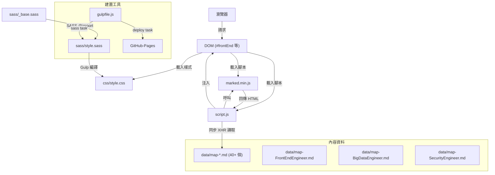

# CODEBASE_MAP — 程式碼地圖

## Annotated Directory Tree

```
skill-map/
│
├── index.html               ★ 唯一入口 HTML 頁面（靜態，全部 UI 結構都在此）
├── package.json             管理 npm scripts 與 devDependencies
├── gulpfile.js              Gulp 建置任務（SASS 編譯 + GitHub Pages 部署）
├── test.md                  開發者的測試草稿 Markdown（非正式測試框架）
├── .gitignore               排除 node_modules, .sass-cache, .publish 等
│
├── js/
│   ├── script.js            ★ 全部應用邏輯（約 215 行 Vanilla JS）
│   │                          - DOM 工具函式（擴展 HTMLElement.prototype）
│   │                          - skillmap 工廠函式（Revealing Module Pattern）
│   │                          - 同步 XHR 載入 Markdown → marked() 解析 → DOM 注入
│   │                          - 樹狀展開/折疊互動邏輯
│   └── marked.min.js        marked.js 壓縮版（Markdown → HTML 解析器，直接 commit 至 repo）
│
├── css/
│   ├── style.css            ▲ 編譯後的 CSS（由 Gulp + SASS 自動生成，勿手動修改）
│   └── style.css.map        ▲ Source map（由 Gulp 自動生成）
│
├── sass/
│   ├── style.sass           ★ 主要 SASS 樣式（@import _base）
│   └── _base.sass           基礎 Reset 與變數
│
├── data/
│   ├── map-MachineLearning.md         機器學習技能圖譜
│   ├── map-Apollo.md                  Apollo 自動駕駛
│   ├── map-BigDataEngineer.md         大數據工程師
│   ├── map-Hadoop.md                  Hadoop
│   ├── map-FrontEndEngineer.md        Web 前端工程師
│   ├── map-MobilePerformanceOptimization.md  移動性能優化
│   ├── map-HTML5.md                   HTML5 開發
│   ├── map-AngularJS2.md              Angular 2
│   ├── map-Architect.md               架構師
│   ├── map-OpenResty.md               OpenResty
│   ├── map-LiveTelecast.md            直播技術
│   ├── map-CDN.md                     CDN 技術
│   ├── map-dns-troubleshoot.md        DNS 排查
│   ├── map-CloudComputing.md          雲計算
│   ├── map-Container.md               容器技術
│   ├── map-Serverless.md              Serverless
│   ├── map-Microservice.md            微服務
│   ├── map-SecurityEngineer.md        安全工程師
│   ├── map-IntelligentDevOps.md       智能運維
│   ├── map-DBA.md                     DBA
│   ├── map-DevOps.md                  DevOps
│   ├── map-Kubernetes.md              Kubernetes
│   ├── map-testing.md                 測試
│   ├── map-MobileWirelessTesting.md   移動無線測試
│   ├── map-MobileDev-iOSDev.md        iOS 開發
│   ├── map-MobileDev-AndroidDev.md    Android App 開發
│   ├── map-MobileDev-AndroidROMDev.md Android ROM 開發
│   ├── map-MobileDev-AndroidArchitect.md  Android 架構師
│   ├── map-EmbeddedEngineer.md        嵌入式開發
│   ├── map-DevLang-Total.md           開發語言總覽
│   ├── map-DevLang-Golang.md          Golang
│   ├── map-DevLang-Clojure.md         Clojure
│   ├── map-DevLang-Python.md          Python
│   ├── map-DevLang-Haskell.md         Haskell
│   ├── map-DevLang-Nodejs.md          Node.js
│   ├── map-DevLang-Ruby.md            Ruby
│   ├── map-DevLang-Java.md            Java
│   ├── map-DevLang-PHP.md             PHP
│   ├── map-Git.md                     Git
│   ├── map-CTO.md                     CTO 技能
│   ├── Preview-source-skillmap-PNG.md PNG 圖片索引文件
│   ├── operation-command.png          運維命令參考圖
│   └── designbyStuQ/                  各技能圖譜的 PNG 圖片版（18 個）
│       └── png-*-by-StuQ.png
│
├── img/
│   ├── plus.png             樹節點「折疊」狀態圖示（CSS list-style-image）
│   ├── minus.png            樹節點「展開」狀態圖示
│   ├── top.svg              「回頂部」按鈕圖示
│   ├── qq.png               QQ 群 QR Code
│   ├── wechat.png           微信群 QR Code
│   ├── GeekTime-QRCode-100X100.png   極客時間 App QR Code（小）
│   ├── GeekTime-QRCode-200X200.png   極客時間 App QR Code（大）
│   ├── StuQ-QRCode-100X100.png       StuQ 公眾號 QR Code
│   └── StuQWMall-QRCode-100X100.png  StuQ 商城 QR Code
│
└── xmind/
    └── *.xmind              XMind 格式的技能圖譜（11 個，部分與 data/ 對應）
```

`★` = 關鍵文件，`▲` = 自動生成（勿手動編輯）

---

## 「我想改 X，要看哪裡？」速查表

| 我想要... | 看這裡 | 關鍵檔案 |
|-----------|--------|---------|
| 新增一個技能圖譜領域 | `data/` + `index.html` + `js/script.js` | `map-NewDomain.md`, `index.html:80-115`, `script.js:126-134` |
| 修正 Markdown 載入路徑（當前 bug） | `js/script.js:126-134` | `script.js` 的 `mdList` 變數 |
| 修改頁面標題 | `index.html:7,22` | `<title>` 和 `<h1>` |
| 調整樹狀 UI 樣式 | `sass/style.sass` | 修改後執行 `gulp sass` |
| 更改預設展開的節點 | `js/script.js:116-122` | `defaultOpen` 陣列 |
| 修改 Markdown 內容 | `data/map-{領域}.md` | 對應的 `.md` 文件 |
| 新增圖片資源 | `img/` 或 `data/designbyStuQ/` | 視用途而定 |
| 更改本地開發 port | `package.json:7` | `"start"` script |
| 部署到 GitHub Pages | `gulp deploy` | `gulpfile.js:6-9` |
| 修改基礎樣式變數 | `sass/_base.sass` | `_base.sass` |
| 更換 Markdown 解析器 | `js/marked.min.js` + `index.html:18` | 替換文件並更新 script 標籤 |
| 查看所有技能圖譜 PNG 預覽 | `data/Preview-source-skillmap-PNG.md` | PNG 索引文件 |

---

## 模組依賴關係圖



---

## 檔案修改影響範圍

| 修改的檔案 | 影響範圍 |
|-----------|---------|
| `sass/style.sass` | 視覺樣式全局（需 `gulp sass` 重新編譯） |
| `sass/_base.sass` | 基礎變數變更，影響所有依賴 `@import base` 的樣式 |
| `js/script.js` | 全部互動邏輯（展開/折疊、載入 Markdown、捲動動畫） |
| `index.html` | 頁面結構、顯示的技能圖譜領域清單 |
| `data/map-*.md` | 單一領域的技能圖譜內容 |
| `gulpfile.js` | 建置流程 |
| `package.json` | 開發腳本與依賴版本 |
