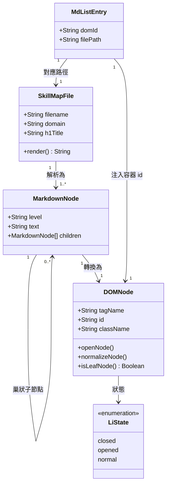

# DATA_MODEL.md — 資料模型說明文件

> 專案：程序員技能圖譜 (StuQ Skill Map)
> 文件版本：2026-04-27
> 授權：CC-BY-NC-SA 4.0

---

## 1. 核心資料實體

### 1.1 Skill Map 文件（`data/map-*.md`）

每份技能圖譜是一個獨立的 Markdown 純文字檔案，遵循共同的分級規範（見 §3）。

**基本屬性**

| 屬性 | 說明 |
|------|------|
| 檔名 | `map-{領域識別碼}.md`，全小寫英文或 CamelCase |
| 編碼 | UTF-8 |
| 格式 | 純 Markdown，無 YAML front matter |
| 根節點 | `#` 標題，代表整份圖譜的名稱 |
| 內容深度 | 最多 6 層：`#` / `##` / `###` / `-` / `*` / `+` |

**文件實例（`data/map-FrontEndEngineer.md` 片段）**

```markdown
# 前端工程師技能圖譜          ← 根節點（h1）

## 瀏覽器                      ← 主幹分類（h2）
  - IE6/7/8/9/10/11 (Trident) ← 一級分支（li）
  - Firefox (Gecko)

## 開發工具                    ← 主幹分類（h2）

### 編輯器和IDE                ← 子分類（h3）
  - VIM/Sublime Text2          ← 一級分支（li）
  - Atom

### 調試工具
    - Firebug/Firecookie
```

---

### 1.2 Markdown 分級規範

定義來源：`README.md` §「图谱 MarkDown 分级规范」

```
# 根節點（最高級別主幹）
## 次主幹
### 三級主幹
-  一級分支（優先級最高）
*  二級分支
+  三級分支（優先級最低）
```

---

### 1.3 DOM 節點狀態模型

每個由 `<li>` 元素代表的樹節點，在 runtime 具有三種互斥狀態，由 CSS class 驅動：

| 狀態 | CSS Class | 觸發條件 | `list-style-image` | 子節點可見性 |
|------|-----------|----------|---------------------|-------------|
| 已折疊 | `closed` | 初始化時有後代 `<li>` | `plus.png` | 隱藏（加 `hide`） |
| 已展開 | `opened` | 使用者點擊展開 | `minus.png` | 可見 |
| 葉節點 | `normal` | `isLeafNode() === true` | `none` | 無子節點 |

**狀態轉換規則**（`js/script.js:147-161`）

```
closed ──點擊──▶ opened
opened ──點擊──▶ closed
normal ────────▶ 不可點擊（cursor: initial）
```

---

## 2. 資料結構關係圖（Mermaid）



---

## 3. Markdown 分級規範對照表

| Markdown 語法 | 層級 | HTML 輸出 | CSS 選擇器 | 視覺效果 |
|--------------|------|-----------|-----------|---------|
| `# 標題` | 1 | `<h1>` | `h1` | 最大字體，頁面主標題 |
| `## 標題` | 2 | `<h2>` | `h2` | 大字體，主幹分類 |
| `### 標題` | 3 | `<h3>` | `h3` | 中字體，子分類 |
| `- 項目` | 4 | `<ul><li>` | `li.closed` / `li.opened` | plus/minus 圖示，可折疊 |
| `* 項目` | 5 | `<ul><li>` | `li.closed` / `li.normal` | 同上，次層縮排 |
| `+ 項目` | 6 | `<ul><li>` | `li.normal` | 無圖示，葉節點 |

> **注意**：marked.js 不區分 `-`、`*`、`+` 的語義優先級，均輸出相同的 `<ul><li>` 結構。優先級差異只存在於 Markdown 撰寫規範中，視覺層次靠縮排（indent）決定。

---

## 4. 資料生命週期

```
[原始資料] data/map-*.md
     │
     │  XHR GET（同步，阻塞主線程）
     │  readTextFile() — js/script.js:89-97
     ▼
[字串] rawText（Markdown 原始文字）
     │
     │  marked(rawText)
     │  marked.min.js（第三方 library，bundle 在 repo）
     ▼
[字串] HTML 字串（<h1><h2><ul><li>... 結構）
     │
     │  $id(domId).innerHTML = ...
     │  js/script.js:137
     ▼
[DOM] 注入至 <div class="node" id="{domId}">
     │
     │  遍歷所有 <li>（js/script.js:140-162）
     │  isLeafNode() 判斷是否有後代 <li>
     ▼
[DOM] 節點分類與初始化
     ├─ 有後代 <li> → addClass('closed')，lastElementChild.addClass('hide')
     └─ 無後代 <li> → addClass('normal')
     │
     │  使用者點擊
     ▼
[互動] 狀態切換（closed ↔ opened）
     ├─ 移除/加入 'hide' class 控制子節點可見性
     └─ CSS list-style-image 切換 plus.png / minus.png
```

---

## 5. mdList 映射表與路徑錯誤

`script.js:126-134` 定義的 `mdList` 物件將 DOM 容器 id 對應到 Markdown 檔案路徑：

```javascript
var mdList = {
  'devLang':       'data/dev-lang.md',
  'bigData':       'data/big-data.md',
  'cloudComputing':'data/cloudComputing.md',
  'frontEnd':      'data/frontEnd.md',
  'IH':            'data/IH.md',
  'IOAM':          'data/IOAM.md',
  'security':      'data/security.md'
};
```

### 路徑錯誤對照表

| DOM id | script.js 中的路徑（錯誤） | data/ 目錄實際檔案 | 狀態 |
|--------|--------------------------|-------------------|------|
| `devLang` | `data/dev-lang.md` | `data/map-DevLang-Total.md` | ❌ 404 |
| `bigData` | `data/big-data.md` | `data/map-BigDataEngineer.md` | ❌ 404 |
| `cloudComputing` | `data/cloudComputing.md` | `data/map-CloudComputing.md` | ❌ 404 |
| `frontEnd` | `data/frontEnd.md` | `data/map-FrontEndEngineer.md` | ❌ 404 |
| `IH` | `data/IH.md` | `data/map-EmbeddedEngineer.md` | ❌ 404 |
| `IOAM` | `data/IOAM.md` | `data/map-IntelligentDevOps.md` | ❌ 404 |
| `security` | `data/security.md` | `data/map-SecurityEngineer.md` | ❌ 404 |

**影響**：`readTextFile()` 收到 404 回應，`marked(undefined)` 被注入容器，技能樹顯示為空白。`try/catch` 只做 `console.log(error)`，不顯示任何錯誤提示給使用者。

**根本原因**：`data/` 目錄在某個時間點進行了檔名重構（統一加上 `map-` 前綴），但 `index.html` 與 `script.js` 未同步更新。

---

## 6. 技能圖譜文件分類清單（40 個）

### 人工智能 AI（2 個）

| 檔案 | 技術領域 |
|------|---------|
| `map-MachineLearning.md` | 機器學習 |
| `map-Apollo.md` | Apollo 自動駕駛 |

### 大數據（2 個）

| 檔案 | 技術領域 |
|------|---------|
| `map-BigDataEngineer.md` | 大數據工程師 |
| `map-Hadoop.md` | Hadoop |

### Web 前端（5 個）

| 檔案 | 技術領域 |
|------|---------|
| `map-FrontEndEngineer.md` | Web 前端工程師 |
| `map-MobilePerformanceOptimization.md` | 移動性能優化 |
| `map-HTML5.md` | HTML5 開發 |
| `map-AngularJS2.md` | Angular 2 |
| `map-MobileWirelessTesting.md` | 移動無線測試 |

### Server 後端（5 個）

| 檔案 | 技術領域 |
|------|---------|
| `map-Architect.md` | 架構師 |
| `map-OpenResty.md` | OpenResty |
| `map-LiveTelecast.md` | 直播技術 |
| `map-CDN.md` | CDN 技術 |
| `map-dns-troubleshoot.md` | DNS 排查 |

### 雲計算（6 個）

| 檔案 | 技術領域 |
|------|---------|
| `map-CloudComputing.md` | 雲計算 |
| `map-Container.md` | 容器 Container |
| `map-Serverless.md` | Serverless |
| `map-Microservice.md` | 微服務 |
| `map-DevOps.md` | DevOps |
| `map-Kubernetes.md` | Kubernetes |

### 安全（1 個）

| 檔案 | 技術領域 |
|------|---------|
| `map-SecurityEngineer.md` | 安全工程師 |

### 智能運維 / DBA（3 個）

| 檔案 | 技術領域 |
|------|---------|
| `map-IntelligentDevOps.md` | 智能運維 |
| `map-DBA.md` | DBA |
| `map-testing.md` | 測試 |

### 移動開發（4 個）

| 檔案 | 技術領域 |
|------|---------|
| `map-MobileDev-iOSDev.md` | iOS 開發 |
| `map-MobileDev-AndroidDev.md` | Android App 開發 |
| `map-MobileDev-AndroidROMDev.md` | Android ROM 開發 |
| `map-MobileDev-AndroidArchitect.md` | Android 架構師 |

### 智能硬件（1 個）

| 檔案 | 技術領域 |
|------|---------|
| `map-EmbeddedEngineer.md` | 嵌入式開發 |

### 開發語言（9 個）

| 檔案 | 技術領域 |
|------|---------|
| `map-DevLang-Total.md` | 開發語言總覽 |
| `map-DevLang-Golang.md` | Golang |
| `map-DevLang-Clojure.md` | Clojure |
| `map-DevLang-Python.md` | Python |
| `map-DevLang-Haskell.md` | Haskell |
| `map-DevLang-Nodejs.md` | Node.js |
| `map-DevLang-Ruby.md` | Ruby |
| `map-DevLang-Java.md` | Java |
| `map-DevLang-PHP.md` | PHP |

### 開發工具 / 技術管理（2 個）

| 檔案 | 技術領域 |
|------|---------|
| `map-Git.md` | Git |
| `map-CTO.md` | CTO 技能 |

---

## 7. XMind 文件對應關係

`xmind/` 目錄存放 11 個 `.xmind` 格式的心智圖，為對應 Markdown 圖譜的視覺化版本。

| XMind 檔案 | 對應 `data/` 中的 Markdown | 說明 |
|-----------|--------------------------|------|
| `frontEnd.xmind` | `map-FrontEndEngineer.md` | Web 前端工程師 |
| `big-data.xmind` | `map-BigDataEngineer.md` | 大數據工程師 |
| `cloudComputing.xmind` | `map-CloudComputing.md` | 雲計算 |
| `security.xmind` | `map-SecurityEngineer.md` | 安全工程師 |
| `IOAM.xmind` | `map-IntelligentDevOps.md` | 智能運維 |
| `DBA.xmind` | `map-DBA.md` | DBA |
| `HTML5.xmind` | `map-HTML5.md` | HTML5 開發 |
| `Java.xmind` | `map-DevLang-Java.md` | Java 語言 |
| `dev-lang-total.xmind` | `map-DevLang-Total.md` | 開發語言總覽 |
| `dev-lang-Go.xmind` | `map-DevLang-Golang.md` | Golang 語言 |
| `micro-service.xmind` | `map-Microservice.md` | 微服務 |

> ⚠️ 未驗證：XMind 檔案內容與對應 Markdown 的版本是否同步（最後更新時間不明）。部分 Markdown 圖譜（如 `map-Kubernetes.md`、`map-Apollo.md` 等 29 個）無對應的 `.xmind` 檔案。

---

## 附錄：關鍵程式碼位置索引

| 功能 | 位置 |
|------|------|
| DOM Prototype Extension | `js/script.js:9-60` |
| `mdList` 映射表 | `js/script.js:126-134` |
| XHR 同步載入 | `js/script.js:89-97` |
| marked.js 解析注入 | `js/script.js:136-138` |
| 節點狀態初始化 | `js/script.js:140-162` |
| 展開/折疊全局控制 | `js/script.js:186-204` |
| Markdown 分級規範定義 | `README.md:83-91` |
| DOM 容器宣告 | `index.html:80-115`（⚠️ 未驗證具體行號） |
