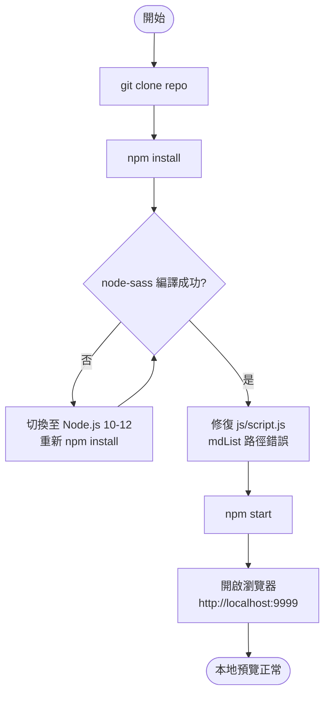
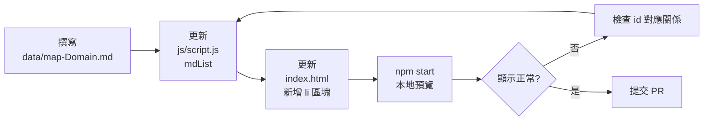

# 程序員技能圖譜（StuQ Skill Map）開發者上手指南

> 版本：V1.0 | 授權：CC-BY-NC-SA 4.0 | 維護：極客邦科技 Geekbang

---

## 目錄

1. [Prerequisites](#1-prerequisites)
2. [本地開發環境建置](#2-本地開發環境建置)
3. [Workflow：新增一個技能圖譜](#3-workflow新增一個技能圖譜)
4. [建置與部署](#4-建置與部署)
5. [常見踩坑](#5-常見踩坑)
6. [Contribution 流程](#6-contribution-流程)

---

## 1. Prerequisites

| 工具 | 建議版本 | 說明 |
|------|---------|------|
| Node.js | **10.x 或 12.x** | Gulp 3.x + gulp-sass 2.x（依賴 node-sass 原生模組）對 Node.js 10-12 相容性最佳；**不建議使用 Node.js 14+**，node-sass 編譯會失敗 |
| npm | 6.x（隨 Node.js 10-12 附帶） | 用於安裝依賴 |
| Git | 任意現代版本 | 用於 clone 與貢獻 PR |
| gulp-cli（全域） | 3.x | 建議全域安裝，詳見第 4 節 |

**確認環境：**

```bash
node -v   # 應顯示 v10.x.x 或 v12.x.x
npm -v    # 應顯示 6.x.x
git --version
```

> 若系統已安裝較新版本的 Node.js，建議使用 [nvm](https://github.com/nvm-sh/nvm) 或 [n](https://github.com/tj/n) 切換版本。

---

## 2. 本地開發環境建置

### 開發工作流程總覽



### Step 1：Clone Repository

```bash
git clone https://github.com/TeamStuQ/skill-map.git
cd skill-map
```

### Step 2：安裝依賴

```bash
npm install
```

**注意事項：**
- `npm install` 會觸發 `node-sass` 的原生模組編譯（C++ binding）
- 若出現 `gyp ERR!` 或 `node-sass` 相關錯誤，請參閱第 5 節的解決方法
- `node_modules/` 已被 `.gitignore` 排除，不會被 commit

### Step 3：修復 `js/script.js` 路徑錯誤（必要 Workaround）

這是一個**已知 Bug**：`js/script.js` 中的 `mdList` 物件路徑與 `data/` 目錄的實際檔名不符，導致所有技能圖譜 AJAX 請求 404 失敗、樹狀結構無法顯示。

**需要修改的位置：`js/script.js`，第 126–134 行**

將以下錯誤設定：

```javascript
// 錯誤：指向不存在的舊檔名
var mdList = {
  'devLang':        'data/dev-lang.md',
  'bigData':        'data/big-data.md',
  'cloudComputing': 'data/cloudComputing.md',
  'frontEnd':       'data/frontEnd.md',
  'IH':             'data/IH.md',
  'IOAM':           'data/IOAM.md',
  'security':       'data/security.md'
};
```

替換為以下正確設定：

```javascript
// 正確：對應 data/ 目錄的實際檔名
var mdList = {
  'devLang':        'data/map-DevLang-Total.md',
  'bigData':        'data/map-BigDataEngineer.md',
  'cloudComputing': 'data/map-CloudComputing.md',
  'frontEnd':       'data/map-FrontEndEngineer.md',
  'IH':             'data/map-EmbeddedEngineer.md',
  'IOAM':           'data/map-IntelligentDevOps.md',
  'security':       'data/map-SecurityEngineer.md'
};
```

### Step 4：啟動本地開發伺服器

```bash
npm start
```

這會執行 `http-server . -p 9999 -o`，自動開啟瀏覽器並導向 `http://localhost:9999`。

> **重要**：必須透過 http-server 存取，不可直接用瀏覽器開啟 `index.html` 檔案（`file://` 協定會觸發同步 XHR 限制，Markdown 無法載入）。

### Step 5：確認結果

瀏覽器開啟 `http://localhost:9999` 後，應看到技能圖譜首頁，點擊各領域標題可展開樹狀技能節點。

---

## 3. Workflow：新增一個技能圖譜

新增一個技能圖譜需要同步修改 **3 個地方**，缺一不可。

### 新增技能圖譜的完整步驟



### 修改位置 1：建立 Markdown 文件

在 `data/` 目錄下建立 `map-{DomainName}.md`，命名規範採用大駝峰（PascalCase）。

**Markdown 分級規範（必須遵循）：**

| 層級 | 符號 | 說明 |
|------|------|------|
| 一級主幹 | `#` | 最頂層標題，整個圖譜的根節點 |
| 二級主幹 | `##` | 主要分類 |
| 三級主幹 | `###` | 子分類 |
| 次級分支 | `-`（破折號） | 優先級最高的列表項目 |
| 次次級分支 | `*`（星號） | 優先級中等的列表項目 |
| 最末分支 | `+`（加號） | 優先級最低的列表項目 |

**範例結構（`data/map-NewDomain.md`）：**

```markdown
# 新領域技能圖譜

## 基礎知識

### 核心概念
- 概念 A
  * 子項目 A-1
  * 子項目 A-2
    + 細項 A-2-a
- 概念 B

### 工具鏈
- 工具 X
- 工具 Y

## 進階技能

### 架構設計
- 設計模式
- 效能優化
```

### 修改位置 2：更新 `js/script.js` 的 mdList

在 `js/script.js` 第 126–134 行的 `mdList` 物件中新增一筆映射：

```javascript
var mdList = {
  // ... 既有項目 ...
  'newDomain': 'data/map-NewDomain.md'  // 新增這一行
};
```

- **key**（左側）：即 HTML 中 `<div class="node">` 的 `id` 屬性值
- **value**（右側）：相對於 repo 根目錄的 Markdown 檔案路徑

### 修改位置 3：更新 `index.html`

在 `index.html` 的 `<ul id="rootList">` 內，新增對應的 `<li>` 區塊：

```html
<li id="newDomainIndex">
  <h2>新領域名稱</h2>
  <span>（貢獻者：@your-github-handle；下載：
    <a href="data/map-NewDomain.md"
       download="新領域(StuQ 技能圖譜).md">新領域.md</a> |
    <a href="data/designbyStuQ/png-NewDomain-by-StuQ.png"
       download="新領域.png">新領域.png</a>
  ）</span>
  <div class="node" id="newDomain"></div>
</li>
```

**id 對應關係（關鍵）：**

```
<li id="newDomainIndex">          ← li 的 id = key + "Index"
  <div id="newDomain">            ← div 的 id = mdList 的 key
```

### 本地預覽

```bash
npm start
```

開啟 `http://localhost:9999`，找到新增的領域標題，點擊確認樹狀結構可正確展開。

---

## 4. 建置與部署

### 專案 npm Scripts

| 指令 | 對應命令 | 說明 |
|------|---------|------|
| `npm start` | `http-server . -p 9999 -o` | 啟動本地開發伺服器 |
| `npm run gulp` | `gulp` | 執行 Gulp（需搭配 task 名稱） |

### Gulp 任務

#### SASS 編譯

```bash
# 使用 npm script
npm run gulp -- sass

# 或若已全域安裝 gulp
gulp sass
```

執行後會將 `sass/style.sass` 編譯至 `css/style.css`，並同時產生 `css/style.css.map`（Source Map）。

**SASS 目錄結構：**

```
sass/
├── _base.sass    # 基礎變數、Reset 樣式
└── style.sass    # 主要樣式（@import _base）
```

修改 SASS 後需重新執行 `gulp sass`，重新整理瀏覽器以看到樣式變更。

#### GitHub Pages 部署

```bash
gulp deploy
```

`gulp deploy` 會將整個 repo 的所有檔案推送至 `gh-pages` 分支，GitHub Pages 會自動從該分支提供靜態網站服務。

`.publish/` 是 `gulp-gh-pages` 的暫存目錄，已被 `.gitignore` 排除。

### 全域安裝 Gulp 3.x（建議）

本專案使用 Gulp **3.x**（`^3.9.0`），與目前主流的 Gulp 4.x 語法不相容。若系統已安裝 Gulp 4，建議另行全域安裝指定版本：

```bash
npm install -g gulp@3
```

確認版本：

```bash
gulp --version
# 應顯示：CLI version 3.9.x
```

---

## 5. 常見踩坑

### 問題 1：node-sass 原生模組編譯失敗

**症狀：**

```
gyp ERR! build error
node-sass@2.x.x not compatible with node@xx.x.x
```

**原因：** `gulp-sass@2.1.1` 依賴 `node-sass`，後者是 C++ 原生擴展，需在安裝時針對當前 Node.js 版本進行編譯。Node.js 14+ 不支援此版本的 node-sass。

**解決方法：**

```bash
# 使用 nvm 切換到相容版本
nvm install 12
nvm use 12
node -v  # 確認為 v12.x.x

# 清除後重新安裝
rm -rf node_modules
npm install
```

---

### 問題 2：技能圖譜不顯示（白頁或空白樹）

**症狀：** 網站可正常載入，但點擊各領域標題後技能樹沒有內容，開發者工具 Network 面板顯示 `data/frontEnd.md`、`data/big-data.md` 等請求回傳 **404**。

**原因：** 這是 `js/script.js` 中 `mdList` 路徑與實際 `data/` 目錄檔名不一致的**已知 Bug**（詳見第 2 節 Step 3）。

**解決方法：** 按照 Step 3 的說明，手動更新 `js/script.js` 第 126–134 行的 `mdList` 路徑。

---

### 問題 3：直接開啟 `index.html` 無法載入技能圖譜

**症狀：** 雙擊 `index.html` 用瀏覽器開啟（`file://` 協定），技能圖譜完全無法載入。

**原因：** `js/script.js` 使用 `XMLHttpRequest` 載入 Markdown 文件；現代瀏覽器的安全策略禁止在 `file://` 協定下發送跨來源 XHR 請求。

**解決方法：** 必須透過 HTTP 伺服器存取：

```bash
npm start
# 開啟 http://localhost:9999
```

---

### 問題 4：Gulp 版本衝突

**症狀：**

```
AssertionError: Task function must be specified
```

或執行 `gulp sass` 時無任何輸出且立即結束。

**原因：** 系統安裝的是 Gulp 4.x CLI，但本專案的 `gulpfile.js` 使用 Gulp 3.x 語法（`gulp.task('name', fn)` 形式，Gulp 4 需要不同的寫法）。

**解決方法：**

```bash
# 全域安裝 Gulp 3.x
npm install -g gulp@3

# 確認版本
gulp --version
```

---

### 問題 5：新增圖譜後節點無法展開

**症狀：** 新領域標題出現在頁面上，但點擊後無法展開技能樹。

**排查清單：**

- [ ] `mdList` 的 key 是否與 `<div class="node" id="...">` 完全一致（大小寫敏感）
- [ ] `<li>` 的 `id` 是否為 `{key}Index` 格式
- [ ] `data/map-{Domain}.md` 是否存在且路徑正確
- [ ] 開發者工具 Network 面板確認 Markdown 請求是否 200

---

## 6. Contribution 流程

### 貢獻一個新技能圖譜

```
1. Fork → https://github.com/TeamStuQ/skill-map/fork
2. 在 Fork 的 repo 建立功能分支
   git checkout -b add-rust-skill-map
3. 完成三處修改（data/*.md、script.js、index.html）
4. 本地驗證（npm start 確認顯示正常）
5. 提交 PR 至主倉庫 master 分支
```

### Markdown 分級撰寫規範

貢獻 Markdown 技能圖譜時，**必須遵循**以下分級規範，以確保 `marked.js` 能正確解析並渲染為樹狀結構：

1. 使用 `#`、`##`、`###` 依序表示**高階主幹分級**（對應樹的主要骨架）
2. 次級分支使用 `-`、`*`、`+` 三種符號區分層次
3. `-`（破折號）的優先級高於 `*`（星號）
4. `*`（星號）的優先級高於 `+`（加號）

### PR 提交注意事項

- PR 標題格式：`[New Skill Map] {領域名稱} by @{github-handle}`
- PR 描述中說明：領域範圍、參考資料、貢獻者資訊
- 若有 PNG 圖片版，一併放入 `data/designbyStuQ/png-{Domain}-by-StuQ.png`
- 若有 XMind 檔，放入 `xmind/{name}.xmind`

### 聯絡方式

| 管道 | 資訊 |
|------|------|
| GitHub Issues | https://github.com/TeamStuQ/skill-map/issues |
| Email | sean@geekbang.org |
| 官方網站 | http://skill-map.stuq.org/ |

有任何改進建議、錯誤回報或新圖譜推薦，歡迎透過 Issue 或 Email 聯絡。

---

## 附錄：專案目錄速查

```
skill-map/
├── index.html              # 唯一入口頁面（需同步更新新圖譜的 <li>）
├── package.json            # npm 設定（scripts: start / gulp）
├── gulpfile.js             # Gulp 建置任務（sass / deploy）
├── js/
│   ├── script.js           # 核心邏輯（mdList 路徑映射在此）
│   └── marked.min.js       # Markdown 解析器（已 bundle）
├── css/
│   └── style.css           # 編譯後的樣式（勿手動修改）
├── sass/
│   ├── style.sass          # 主樣式入口
│   └── _base.sass          # 基礎變數
└── data/
    ├── map-*.md            # 技能圖譜 Markdown（命名規範：map-{Domain}.md）
    └── designbyStuQ/       # PNG 圖片版（png-{Domain}-by-StuQ.png）
```

---

*本文件由 .trace/DEV_GUIDE.md 維護，如發現錯誤請提交 Issue 或 PR。*
